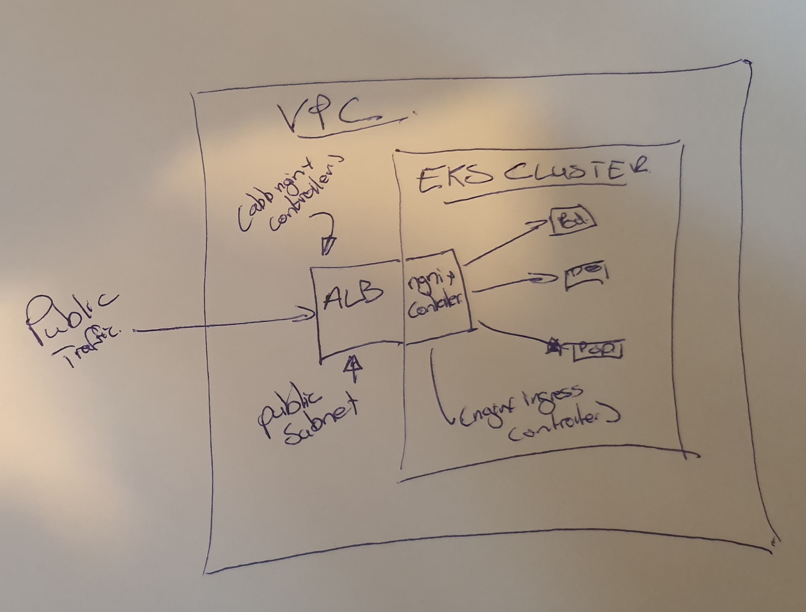

# SIMPLE EKS CLUSTER SETUP

This repo contains a reference to provision an eks cluster via eksctl.  
Included is an extras section to bootstrap CI and CD components into the cluster along with  ingress.

**Background:**

This is Part 1 of a cluster setup 
see the bellow repos for next steps:

* [Part 1 setting up EKS ](https://github.com/bbdsoftware/eks-bootstrap)
* [Part 2 setting up CI](https://github.com/bbdsoftware/eks-jenkins-ci)
* [Part 3 setting up CD ](https://github.com/bbdsoftware/eks-argo-cd)

**Service example:**
An example spring boot service can be found here.  [demo](https://github.com/bbdsoftware/eks-pring-boot-jenkinsop-example) 
This is referenced in all parts as a demo service

**In use:**
* [helm](https://helm.sh/)
* [argocd](https://argoproj.github.io/argo-cd/)
* [Jenkins operator](https://jenkinsci.github.io/kubernetes-operator/)
* [eksctl fro EKS](https://eksctl.io)


**Reference articles and videos:**
* https://www.twistlock.com/2018/08/06/gitops-101-gitops-use/
* https://www.weave.works/blog/what-is-gitops-really
* https://jenkins.io/doc/book/pipeline/
* https://www.youtube.com/watch?v=4owbdHzfyMY
* https://blog.argoproj.io/introducing-argo-cd-declarative-continuous-delivery-for-kubernetes-da2a73a780cd
* https://eksctl.io
* https://docs.aws.amazon.com/eks/latest/userguide/getting-started.html


---
**NOTE**

Once this is completed please see  [Part 2 setting up CI](https://github.com/bbdsoftware/eks-jenkins-ci) for setting up ci based on jenkins operator

---


## Creating  EKS cluster 
The folder *eksctl* contains a reference eks cluster yaml definition  to provision a cluster on aws

Run

```eksctl create cluster -f eksctl/eksctl-cluster```

References :
* https://github.com/weaveworks/eksctl
* https://eksctl.io
* https://eksctl.io/usage/creating-and-managing-clusters/   


## Extras

### Ingress
---



The ingress folder contains a *setupingress.sh* script.  
The script assumes you have helm installed and configured 

The set up leverages the use of aws alb ingress controller and nginx ingress controller.  
One alb targeted ingress is created for the nginx-controller. This will effectivelfy create one alb ingress on AWS ingressing all traffic to the nginx-ingress controller. 

After this all workloads deployed to the cluster can target the nginx ingress type  ie ``` kubernetes.io/ingress.class: nginx``` as this will be the base controller used for ingress.


TODO INSET IMAGE


Steps:  
* You will need to provide the cluster vpc to the [values-alb-ingress.yaml ](./extras/ingress/values-alb-ingress.yaml) 
    ```clusterName: ql-dev-stage
    awsRegion: eu-west-1
    awsVpcID: "TOBEREPLACED"
    rbac:
    create: true
    serviceAccountName: alb-ingress
     ```
* You will need to provide the R53 domain and zoneid to the [values-eternal-dns.yaml ](./extras/ingress/values-eternal-dns.yaml) 
    ```
    ....
        domainFilters: [TOBEREPLACED]
        zoneIdFilters: [TOBEREPLACED]

     ```
     ```
* You will need to provide your cert arn  [alb-nginx-controller ](./extras/ingress/alb-nginx-controller) 
    ```
    ....
            name: ql-alb-nginx
            namespace: ingress-system
            annotations:
                alb.ingress.kubernetes.io/healthcheck-path: /
                alb.ingress.kubernetes.io/listen-ports: '[{"HTTP":80,"HTTPS": 443}]'
                alb.ingress.kubernetes.io/actions.ssl-redirect: '{"Type": "redirect", "RedirectConfig": { "Protocol": "HTTPS", "Port": "443", "StatusCode": "HTTP_301"}}'
                alb.ingress.kubernetes.io/certificate-arn: [YOURCERTARN]
    ....            
     ```     
* Run script   [setupingress.sh](./extras/ingress/setupingress.sh)  
  ```
  sh  extras/setupingress.sh 
  ```


### CI
---
The ci folder has the set up to deploy the jenkins-operator into the cluster.        
This is used to leverage jenkins as a CI tool to enable ci within the the kubernetes cluster

* Run script   [setupingress.sh](./extras/ci/setupci.sh)  
  ```
  sh  /extras/ci/setupci.sh 
  ```
Please see https://github.com/kanzifucius/spring-boot-k8s-jenkinsop-example for an example spring boot applciation building   using the jenkins operator


References :
* https://jenkinsci.github.io/kubernetes-operator/
* https://github.com/jenkinsci/kubernetes-operator

### CD (GITOPS)
---
The cd folder has the set up to deploy argo-cd into the cluster.        
Argo cd is used as a gitops tool to facilitate CD using gitops principals

steps:

* Supply your domain in the argo ingress manifest   [./extras/cd/ingress.yaml](./extras/cd/ingress.yaml)  
  ```
    ....
    spec:
    rules:
        - host: argogrpc.YOURDOMIAN.com
        http:
            paths:
            - backend:
                serviceName: argocd-server
                servicePort: https
    ....
    rules:
        - host: argo.YOURDOMIAN.com
        http:
            paths:
            - backend:
                serviceName: argocd-server
                servicePort: https

  ```
* Run script   [setupingress.sh](./extras/cd/setupcd.sh)  
  ```
  sh  /extras/cd/setupcd.sh 
  ```
Please see https://github.com/kanzifucius/spring-boot-k8s-jenkinsop-example for an example spring boot applciation building   using the jenkins via the jenkins operator


References :
* https://argoproj.github.io/argo-cd/

